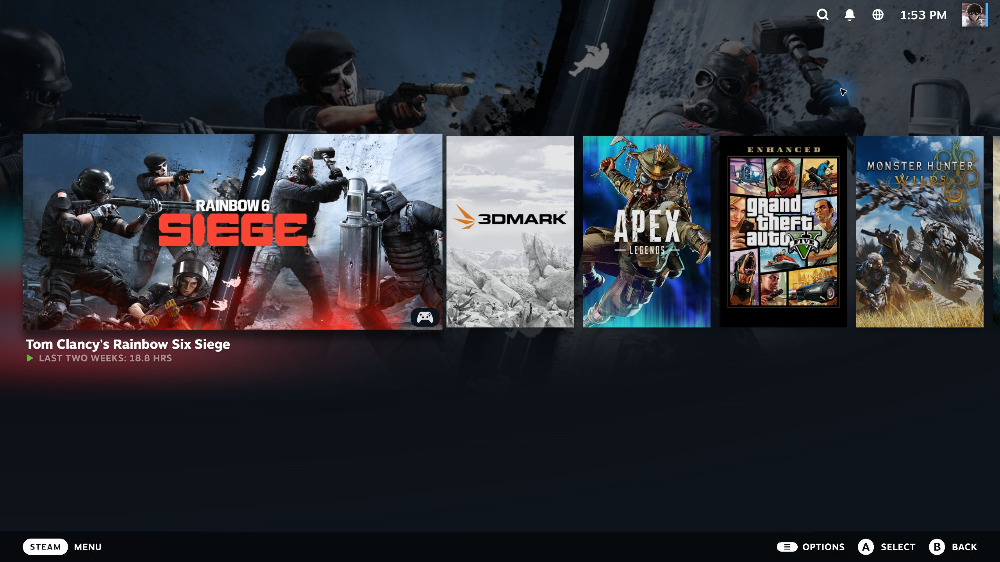

# Clean Big Picture Home

A small [Millennium](https://github.com/SteamClientHomebrew/Millennium) theme for Steam on Windows. It shows only the **Recent Games** area on the Big Picture home screen and moves it lower. The entire section below it is hidden, including:

- **What's New**
- **Friends**
- **Recommended**

It also hides the desktop Library **What's New** shelf and Steam News button, preserving the behavior of [no more whats new](https://steambrew.app/theme/ravniuH9rc1gfE62sDdD).

## Screenshot

## Install

1. Install Millennium if it is not already installed.
2. Copy this repository into `<Steam install directory>/millennium/themes/clean-big-picture-home`.
3. In Steam, open **Steam → Millennium → Themes** and choose **Clean Big Picture Home**.
4. Restart Steam when prompted.

The theme only changes what Steam displays. It does not remove game data, updates, or store data. To undo it, choose another theme in Millennium.

## Compatibility

Verified on Steam for Windows on September 25, 2026. Steam uses generated CSS class names, so a Steam update may require changes to `bigpicture.custom.css`. The theme uses CSS only and does not depend on Steam's display language.

## Credits

The desktop Library selectors are adapted from [no more whats new](https://github.com/lil-fluff/no-more-whats-new), which is released under the Unlicense. This repository is also released under the Unlicense.
